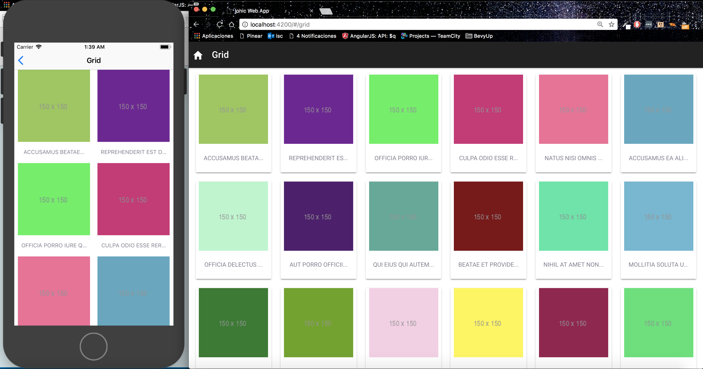
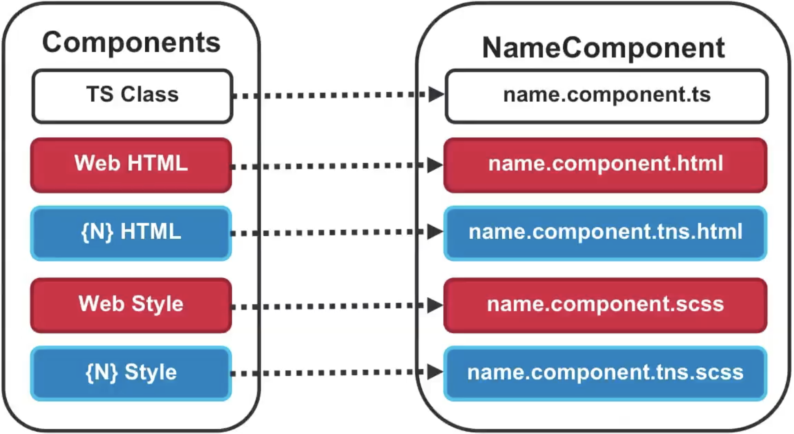

# NativeScript Ionic Template {N}   
**Native mobile Apps** with [NativeScript](https://www.nativescript.org/) and **Web Apps (Mobile First)** with [Ionic](http://ionicframework.com/) styles and components sharing the same code with Angular!
>This template uses the default navigation of Angular, the navigation of Ionic 3 is not recommended to develop websites, therefore it is not recommended to use Ionic components that require Ionic navigation. However, in this template you can find an example of how to use components such as the side menu without depending on the navigation.


## Introduction 👨‍💻
Using this template you can create a **Web App (Mobile First)** using **Ionic 3** components and a **Mobile Native App** using **NativeScript** with the **same code**, yay! 👏



For more details you can check the excellent NativeScript team article about **Code Sharing Between Web and Mobile with Angular and NativeScript**: https://www.nativescript.org/blog/code-sharing-between-web-and-mobile-with-angular-and-nativescript

## How does it work? ☕
Check the excellent video of [Sebastian Witalec](https://github.com/sebawita) about **Sharing Code Between Web and Native Apps** 

[](https://youtu.be/HMPkXk_vXDw?t=11m56s)


## Run the projects ⏯

* **Ionic Web App (Using the Angular-cli)**:
```
  npm install (It's required to create the symlinks at the first time before to execute the app)
  ng serve
```

* **NativeScript Mobile App**:
```
  cd nativescript
  npm install
  npm run livesync (Required to detect changes and reload the app from the simulator/device)
  npm run ios (using other terminal)
```

## Commands 💻
View available commands here: [Seed commands](https://github.com/TeamMaestro/angular-native-seed/wiki/Seed-Commands)

## Getting Started 📚
Command | Action
------- | ------
`npm install -g @angular/cli` | Install the Angular-cli. Remember see the documentation [here](https://github.com/angular/angular-cli#generating-components-directives-pipes-and-services)
`ng g module [name]` | Generate a new Module. Recommended to create sections of your app that will load components with Lazy Loading.
`ng g component [name]` | Generate a new Component in the current directory.
`ng g service [name]` | Generate a new Service. The `app/providers/` path is recommended for shared services among several components.

## Use [Ionic icons](https://ionicframework.com/docs/ionicons/) from the NativeScript side 🎁
NativeScript requires the **unicode** of the icon, you can find the unicode with the name of the icon from the content of the `src/fonts/ionicons.svg` file and later you can use it from a `<Label>` or `<Button>`, example:
```
// name: ion-ios-contact, unicode: &#xf41a;
<Button class="ion-icon" fontSize="25" text="&#xf41a;"></Button>
```

## Custom templates for each platform 🥂
Target **Phone** and **Tablet** Templates individually. The following extensions are supported:

Extension                        | Platform
-------------------------------- | -----------
`.{html/scss}`                   | Web platform. Used from mobile when there is no **.tns** extension
`.tns.{html/scss}`               | Only for mobile
`.tns.ios.{html/scss}`           | Only for iOS
`.tns.android.{html/scss}`       | Only for Android
`.tns.ios.phone.{html/scss}`     | Only for iOS Phone 
`.tns.android.phone.{html/scss}` | Only for Android Phone



## Resources ⛩
- [NativeScript Quick Setup](https://docs.nativescript.org/start/quick-setup)
- [The NativeScript book](https://www.nativescript.org/get-the-nativescript-book)
- [Ionic CSS Utilities](http://ionicframework.com/docs/theming/css-utilities/)
- [NativeScript Styling](https://docs.nativescript.org/ui/styling#supported-css-properties)
- [NativeScript Layout Containers](https://docs.nativescript.org/ui/layout-containers)
- [Professional UI Components](https://www.nativescript.org/ui-for-nativescript)
- [Progress NativeScript UI samples](https://github.com/telerik/nativescript-ui-samples-angular)
- [awesome-nativescript](https://github.com/jbristowe/awesome-nativescript)
- [Awesome {N}](https://github.com/DeviantJS/awesome-nativescript)

## Contributors 🥇
| [](https://github.com/sean-perkins) | [](https://github.com/jdnichollsc) 
:---: | :---: |
[Sean Perkins](https://github.com/sean-perkins) | [Juan Nicholls](mailto:jdnichollsc@hotmail.com) |

## Credits 👍
* [Angular NativeScript Seed](https://github.com/TeamMaestro/angular-native-seed)

## Supporting 🍻
I believe in Unicorns 🦄
Support [me](http://www.paypal.me/jdnichollsc/2), if you do too.

## Happy coding 💯
Made with ❤️


