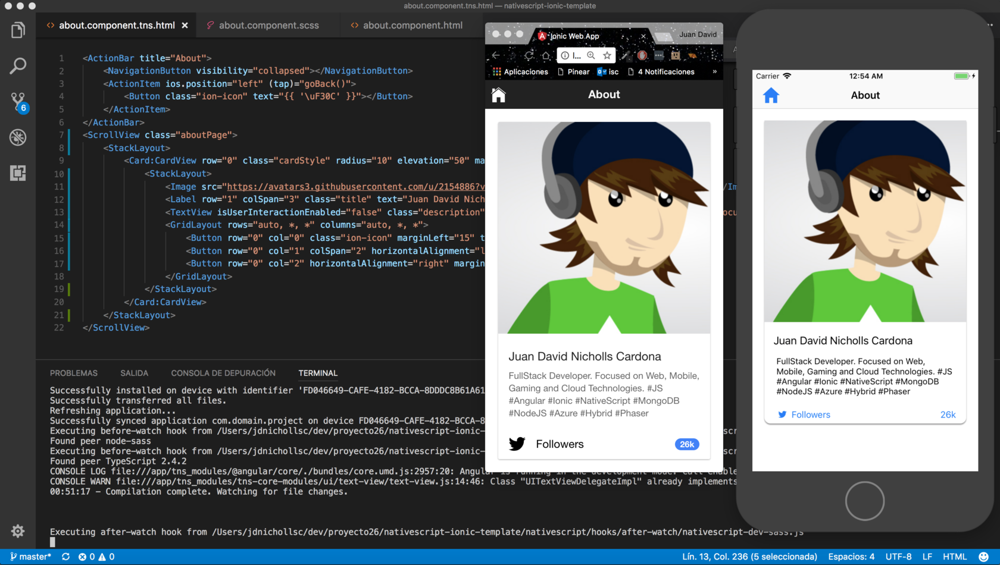

# NativeScript Ionic Template 🤘
An Ionic **(Web)** and NativeScript **(Mobile)** template with **Code Sharing**.



## Introduction 👨‍💻
Using this template you can create a **Web App (Mobile First)** using **Ionic 3** components and a **Mobile Native App** using **NativeScript** with the **same code**, yay! 👏

For more details you can check the excellent NativeScript team article about **Code Sharing Between Web and Mobile with Angular and NativeScript**: https://www.nativescript.org/blog/code-sharing-between-web-and-mobile-with-angular-and-nativescript

## Run the projects ⏯

* **Ionic Web App (Angular-cli)**:
```
  npm i
  ng serve
```

* **NativeScript Mobile App**:
```
  cd nativescript
  npm i
  npm run livesync
  npm run ios (using other terminal)
```

## Commands 💻
View available commands here: [Seed commands](https://github.com/TeamMaestro/angular-native-seed/wiki/Seed-Commands)

## Contributors 🥇
[](https://github.com/jdnichollsc) | [](https://github.com/sean-perkins) |
:---: | :---: |
[Juan Nicholls](mailto:jdnichollsc@hotmail.com) | [Sean Perkins](https://github.com/sean-perkins) |

## Credits 👍
* [Angular NativeScript Seed](https://github.com/TeamMaestro/angular-native-seed)

## Supporting 🍻
I believe in Unicorns 🦄
Support [me](http://www.paypal.me/jdnichollsc/2), if you do too.

## Happy coding 💯
Made with ❤️


